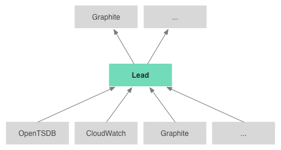

# Lead

[](https://travis-ci.org/also/lead)

Lead ~~is~~ will be a [Graphite](http://graphite.readthedocs.org/en/latest/overview.html) replacement (or enhancement!). Acting as a Graphite client or server, it can integrate all your sources of time-series data.

Graphite provides a rich set of functions to apply to time series, but couples this to a primitive user interface and storage engine. Lead aims to replace all three.

If you're already invested in Graphite, you can use [lead-graphite-server](https://github.com/also/lead-graphite-server) to expose any time-series data to Graphite. For example, you could apply Graphite function to Amazon CloudWatch data, or incorporate a new data store, like [OpenTSDB](http://opentsdb.net/).

If you're happy with Graphite's Carbon data storage, you can use Lead's implementation of the Graphite functions, while using one of the many existing [Graphite UI alternatives](http://graphite.readthedocs.org/en/latest/tools.html), including [lead.js](https://github.com/also/lead.js/blob/master/docs/quickstart.md), a console for exploring Graphite data.



## Integrating

Lead can fetch data from these sources:

* Graphite, using [lead.graphite.connector](src/main/clojure/lead/graphite/connector.clj)
* [Amazon CloudWatch](http://aws.amazon.com/cloudwatch/), using [lead-cloudwatch](https://github.com/also/lead-cloudwatch)
* Anything that implements the Lead [HTTP API](doc/http-api.md), using [lead.connector.remote](src/main/clojure/lead/connector.clj)

## Installation and Configuration

Lead is a written in Clojure, and uses [Leiningen](http://leiningen.org/) to build. After installing Leiningen, make a copy of the Lead [example](example) project. Inside the project directory, run the command

```
lein run 3000 config.clj
```

This runs the server on port 3000 using the `config.clj` configuration file.

See [Configuration](doc/configuration.md) for a list of options.

## Extending

```clojure
; TODO
```

Extend [Connector](src/main/clojure/lead/connector.clj). See [GraphiteConnector](src/main/clojure/lead/graphite/connector.clj) for an example.

## Roadmap

Lead is still experimental, but it can already fetch data from several sources. Soon, it will be expanded to directly support:

* OpenTSDB
* [ElasticSearch](http://www.elasticsearch.org/)
